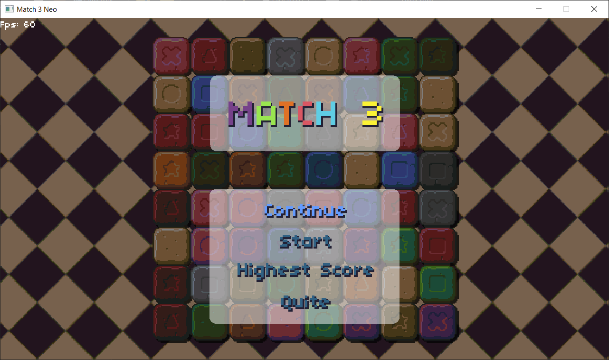
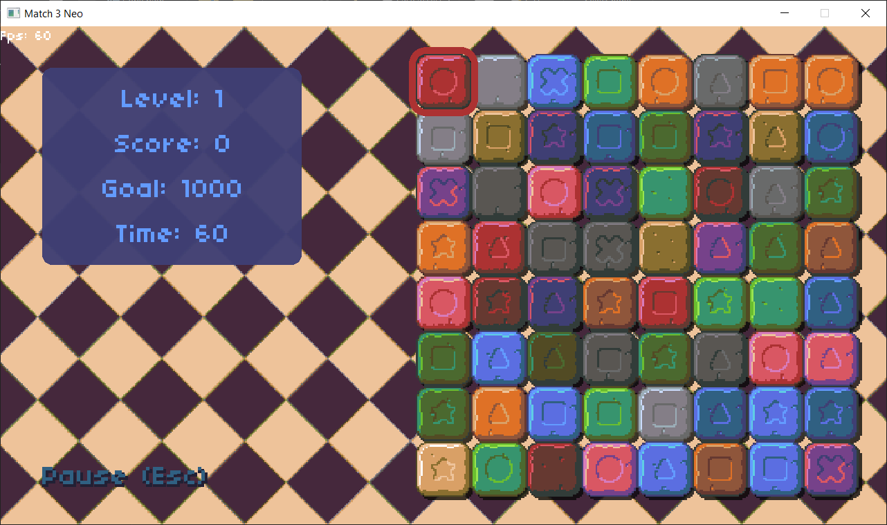
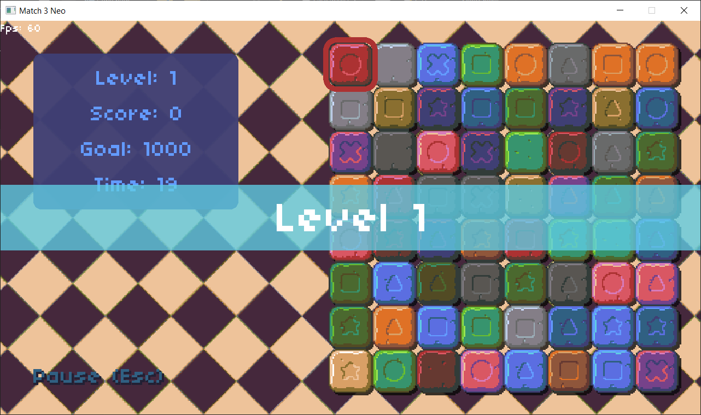
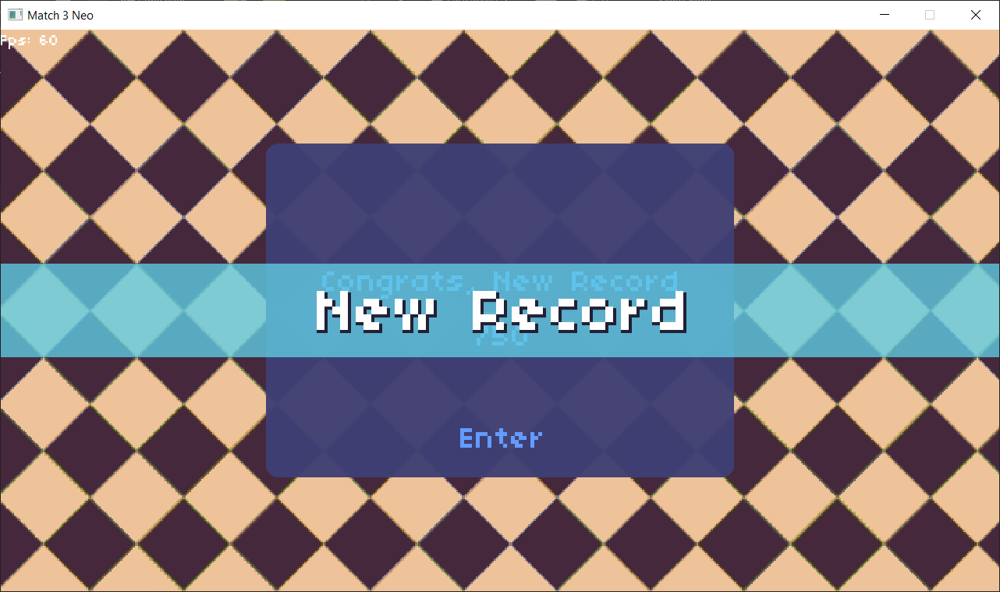
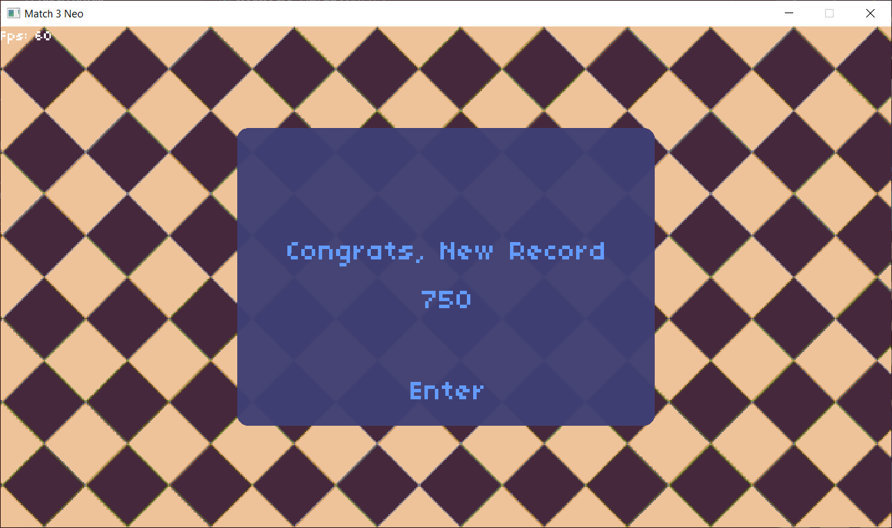

## MATCH 3
I made this game to learn about timers, such as interval timers, delay timers, and tweening. Along the way, I explored how these timers work, implemented my own asynchronous timers and a custom tweener, and used them to create smooth transition effects and animations in the game.
***
I learned it from this [CS50 Match 3 tutorial from YouTube](https://www.youtube.com/live/iZE49t2yBrw?si=z2QTYQJD_RoT6-XY). In that tutorial they used **Lua** with **Love2D**, but I developed my own game engine, called **Byte_Blitz_SFML**, with **SFML** and **C++**, and used [**Byte_Blitz_SFML v2.0.0 Release**](https://github.com/Tushar625/Byte_Blitz_SFML/releases/tag/v2.0.0) to make this game.
***
The New Features I added 
* New sound Effects.
* Particle system explosion effects when the bricks explode.
* Complete Mouse control.
* Entire game gets saved upon closing, including the brickmap.
* Highest Score.
* New game over screen.
***
Some Screenshots from the game

***